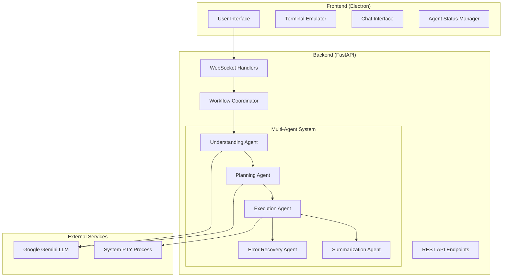

# AI Terminal Copilot (SudoSu)

Welcome to the comprehensive documentation for **SudoSu**, an AI-powered terminal copilot that provides Cursor/Kiro-like experiences specifically for DevOps and terminal operations.

## 🚀 What is SudoSu?

SudoSu is a sophisticated desktop application that combines:

- **Multi-Agent AI System**: 4-phase workflow (Understanding → Planning → Execution → Summarization)
- **Performance Optimization**: <2 second execution for simple commands, smart caching, adaptive timeouts
- **Intelligent Error Recovery**: Context-aware recovery strategies with learning capabilities
- **Real-Time Communication**: WebSocket-based streaming with visual feedback
- **DevOps Specialization**: Expert knowledge in infrastructure, containers, CI/CD, monitoring, and security

## 📋 Documentation

### Core Specifications
- **[Requirements Document](specs/ai-terminal-copilot/requirements)** - Comprehensive functional and non-functional requirements
- **[Design Document](specs/ai-terminal-copilot/design)** - System architecture and technical specifications
- **[Implementation Tasks](specs/ai-terminal-copilot/tasks)** - Complete development roadmap
- **[Flow Documentation](specs/ai-terminal-copilot/flow-documentation)** - Detailed workflow diagrams

### Development Guidelines
- **[Project Context](steering/project-context)** - Essential project context and patterns
- **[Development Standards](steering/development-standards)** - Coding standards and best practices
- **[Performance Guidelines](steering/performance-guidelines)** - Performance optimization strategies

### Project Information
- **[Project Overview](project-overview)** - Detailed project summary and roadmap

## 🏗️ Architecture Overview



## 🎯 Key Features

### Agent Mode Workflow
1. **Understanding Phase**: AI analyzes requests and identifies objectives
2. **Planning Phase**: Creates step-by-step execution plans
3. **Execution Phase**: Executes commands with monitoring and recovery
4. **Summarization Phase**: Generates friendly summaries of accomplishments

### Chat Mode
- Conversational DevOps guidance
- Code blocks with Copy/Apply functionality
- Persistent session management
- Real-time streaming responses

## 📊 Performance Benchmarks

- **Simple Commands**: <2 seconds (90%+ improvement from 30+ seconds)
- **Moderate Commands**: <10 seconds with caching benefits
- **Complex Commands**: Optimized execution with full analysis
- **WebSocket Messages**: <100ms delivery time
- **Cache Hit Rates**: 60-80% for repeated operations

## 🛠️ Technology Stack

| Component | Technology | Version |
|-----------|------------|---------|
| Frontend Framework | Electron | 28.0.0 |
| Terminal Emulation | xterm.js | 5.3.0 |
| Backend Framework | FastAPI | 0.104.1 |
| AI/LLM | Google Gemini | 2.0-flash |
| Terminal Integration | ptyprocess | 0.7.0 |
| Real-time Communication | WebSockets | - |
| Data Validation | Pydantic | 2.5.0+ |

## 🎯 Example Use Cases

### Infrastructure Management
```bash
# User request: "Set up nginx reverse proxy from port 8000 to port 80"
# SudoSu automatically:
# 1. Analyzes the request
# 2. Plans the installation and configuration steps
# 3. Executes: apt update, install nginx, configure proxy, restart service
# 4. Provides friendly summary of what was accomplished
```

### Development Workflow
```bash
# User request: "Create a new Python project with virtual environment"
# SudoSu automatically:
# 1. Creates project directory
# 2. Sets up virtual environment
# 3. Creates requirements.txt and basic project structure
# 4. Initializes git repository
```

## 🚀 Getting Started

### Prerequisites
- Node.js 16+ for frontend development
- Python 3.8+ for backend development
- Google Gemini API key
- Terminal access for command execution

### Quick Setup
1. Clone the repository
2. Backend: `pip install -r backend/requirements.txt`
3. Frontend: `npm install` in frontend directory
4. Configure environment variables (Google API key)
5. Start backend: `uvicorn main:app --reload`
6. Start frontend: `npm start`

---

**SudoSu** represents a significant advancement in terminal automation, combining the power of modern AI with practical DevOps workflows to create an intelligent, efficient, and user-friendly development experience.