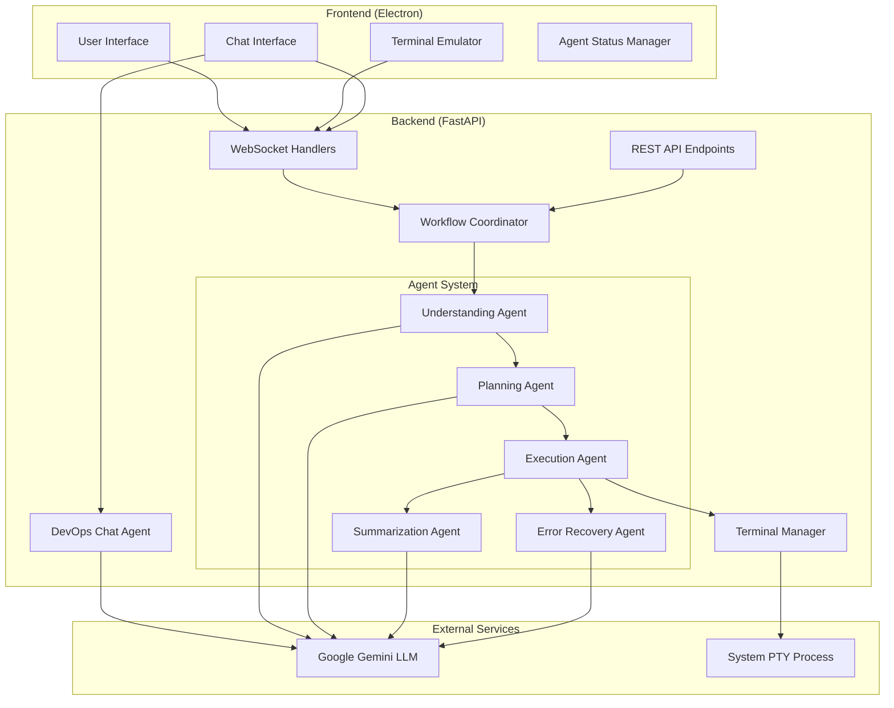
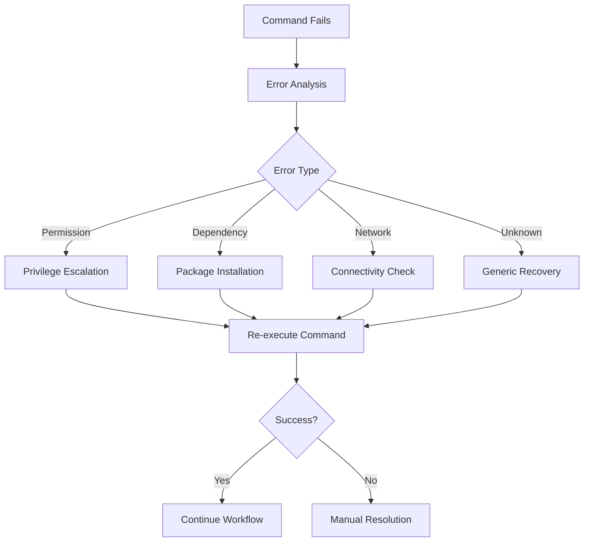

# AI Terminal Copilot - Design Document

## Overview

The AI Terminal Copilot is architected as a distributed system with an Electron-based frontend and FastAPI backend, connected via WebSocket for real-time communication. The system implements a sophisticated multi-agent architecture that processes user requests through distinct phases while maintaining high performance and intelligent error recovery.

## Architecture

### High-Level Architecture



### Component Architecture

#### Frontend Components

**1. Main Application (Electron)**
- **Technology**: Electron 28.0.0 with Node.js integration
- **Responsibilities**: Window management, application lifecycle, native OS integration
- **Key Files**: `frontend/src/main.js`

**2. User Interface Layer**
- **Technology**: Vanilla JavaScript with CSS3
- **Components**:
  - Chat panel with session management
  - Terminal interface with xterm.js
  - Agent status indicators
  - Mode switching (Agent/Chat)
- **Key Files**: `frontend/src/chat.js`, `frontend/src/terminal.js`

**3. Agent Status Manager**
- **Purpose**: Visual feedback for agent workflow phases
- **Features**: Progress indicators, phase transitions, completion states
- **Key Files**: `frontend/src/agent_status_manager.js`

#### Backend Components

**1. API Layer (FastAPI)**
- **Technology**: FastAPI 0.104.1 with Uvicorn
- **Endpoints**:
  - REST endpoints for session management
  - WebSocket endpoints for real-time communication
  - Agent workflow execution endpoints
- **Key Files**: `backend/main.py`

**2. Multi-Agent System**

**Understanding Agent**
- **Purpose**: Analyze and break down user requests
- **Technology**: Google Gemini 2.0-flash with streaming
- **Output**: Structured JSON with objectives, complexity analysis, and recommendations
- **Key Features**: Intent recognition, technology identification, prerequisite analysis

**Planning Agent**
- **Purpose**: Convert objectives into executable terminal command sequences
- **Technology**: Google Gemini 2.0-flash with optimized prompts
- **Output**: Structured plan with step-by-step commands and descriptions
- **Key Features**: Command generation, step sequencing, error handling integration

**Execution Agent**
- **Purpose**: Execute commands with monitoring and recovery
- **Technology**: Async Python with performance optimization
- **Key Features**: 
  - Command classification (Simple/Moderate/Complex)
  - Fast path execution for simple commands
  - Real-time monitoring and feedback
  - Intelligent retry and recovery mechanisms

**Summarization Agent**
- **Purpose**: Generate human-friendly workflow summaries
- **Technology**: Google Gemini 2.0-flash with conversational prompts
- **Output**: Friendly explanations of accomplishments and next steps
- **Key Features**: Natural language generation, context-aware summaries

**Error Recovery Agent**
- **Purpose**: Analyze failures and generate recovery strategies
- **Technology**: Google Gemini 2.0-flash with specialized error analysis prompts
- **Key Features**: Error classification, recovery step generation, safety validation

**3. Terminal Management System**
- **Technology**: ptyprocess for pseudo-terminal integration
- **Features**:
  - Real-time command execution
  - Output limiting and truncation
  - Command echo removal
  - Structured messaging via WebSocket
- **Key Files**: `backend/terminal_manager.py`

**4. Performance Optimization System**
- **Command Classification**: Automatic categorization by complexity
- **Caching Layer**: Explanation and validation result caching
- **Fast Path Execution**: Bypass heavy analysis for simple operations
- **Adaptive Timeouts**: Dynamic timeout adjustment based on command type

## Components and Interfaces

### WebSocket Communication Protocol

```typescript
interface WebSocketMessage {
  type: string;
  data: any;
  timestamp?: string;
}

// Message Types
type MessageType = 
  | "workflow_started"
  | "understanding_started" | "understanding_completed"
  | "planning_started" | "planning_completed"
  | "execution_phase_started" | "step_started" | "step_completed"
  | "summarizing_completed" | "workflow_completed"
  | "error" | "recovery_started"
  | "terminal_output" | "command_start" | "command_end";
```

### Agent Workflow Interface

```python
class WorkflowCoordinator:
    async def execute_complete_workflow(
        self, 
        user_request: str, 
        terminal_session_id: str,
        callback: Optional[Callable] = None
    ) -> Dict[str, Any]
```

### Terminal Management Interface

```python
class TerminalManager:
    async def execute_command(self, command: str, timeout: int = 60) -> dict
    async def send_structured_message(self, message_type: str, data: str, **kwargs)
    def configure_output_limits(self, max_lines: int = 500, truncate_threshold: int = 400)
```

## Data Models

### Core Schemas

```python
class Step(BaseModel):
    id: int
    description: str
    command: str
    status: StepStatus
    output: Optional[str] = None
    error: Optional[str] = None
    started_at: Optional[datetime] = None
    completed_at: Optional[datetime] = None
    retry_count: int = 0
    max_retries: int = 3

class Plan(BaseModel):
    id: str
    objective: str
    steps: List[Step]
    status: PlanStatus
    terminal_session_id: str
    created_at: datetime
    error_message: Optional[str] = None

class UnderstandingResult(BaseModel):
    analysis: Dict[str, Any]
    refined_objectives: List[Dict[str, Any]]
    recommendations: Dict[str, Any]
```

### Session Management

```python
class ChatSession:
    id: str
    name: str
    created_at: datetime
    messages: List[Dict[str, Any]]

class TerminalSession:
    id: str
    process: ptyprocess.PtyProcessUnicode
    websocket: Optional[WebSocket]
    alive: bool
```

## Error Handling

### Error Recovery Strategy



### Error Classification System

1. **Permission Errors**: `sudo` escalation, file permissions
2. **Dependency Errors**: Missing packages, command not found
3. **Network Errors**: Connectivity issues, DNS resolution
4. **Resource Errors**: Disk space, memory limitations
5. **Syntax Errors**: Command syntax, parameter issues

### Recovery Mechanisms

- **Automatic Retry**: Up to 3 attempts with exponential backoff
- **Intelligent Recovery**: Context-aware recovery strategies
- **User Intervention**: Clear error messages and manual resolution steps
- **Learning System**: Improve recovery strategies based on success patterns

## Testing Strategy

### Unit Testing
- **Agent Components**: Mock LLM responses, test logic flows
- **Terminal Manager**: Mock ptyprocess, test command execution
- **WebSocket Handlers**: Mock connections, test message protocols
- **Performance Optimizer**: Test command classification and caching

### Integration Testing
- **Agent Workflow**: End-to-end workflow execution
- **WebSocket Communication**: Real-time message flow
- **Terminal Integration**: Actual command execution and output handling
- **Error Recovery**: Failure scenarios and recovery validation

### Performance Testing
- **Command Execution Speed**: Measure response times across complexity levels
- **Memory Usage**: Monitor terminal output limits and memory consumption
- **Concurrent Sessions**: Test multiple terminal and chat sessions
- **WebSocket Scalability**: Test real-time communication under load

### User Acceptance Testing
- **Workflow Usability**: User experience through complete agent workflows
- **Error Handling**: User experience during failure and recovery scenarios
- **Performance Perception**: User satisfaction with response times
- **Feature Completeness**: Validation of all requirements against user needs

## Security Considerations

### Command Execution Security
- **Command Validation**: Sanitize and validate commands before execution
- **Privilege Escalation**: Secure handling of `sudo` and elevated permissions
- **Path Traversal**: Prevent unauthorized file system access
- **Resource Limits**: Prevent resource exhaustion attacks

### API Security
- **Input Validation**: Validate all API inputs and WebSocket messages
- **Rate Limiting**: Prevent abuse of LLM and terminal resources
- **Session Management**: Secure session tokens and cleanup
- **Error Information**: Limit sensitive information in error messages

### LLM Security
- **Prompt Injection**: Sanitize user inputs to prevent prompt manipulation
- **Output Validation**: Validate LLM outputs before execution
- **API Key Management**: Secure storage and rotation of API keys
- **Usage Monitoring**: Monitor LLM usage for anomalies

## Performance Optimization

### Command Classification System

```python
class CommandComplexity(Enum):
    SIMPLE = "simple"      # <2 seconds, no LLM validation
    MODERATE = "moderate"  # <10 seconds, cached explanations
    COMPLEX = "complex"    # Full analysis, optimized monitoring

# Classification Examples
SIMPLE_COMMANDS = ["touch", "mkdir", "ls", "pwd", "echo"]
MODERATE_COMMANDS = ["git", "npm", "pip", "docker ps"]
COMPLEX_COMMANDS = ["docker build", "make install", "npm run build"]
```

### Caching Strategy

- **Explanation Cache**: 5-10 minutes TTL for command explanations
- **Validation Cache**: 2-5 minutes TTL for validation results
- **LRU Eviction**: Automatic cleanup of old cache entries
- **Context-Aware Keys**: Include command context in cache keys

### Fast Path Execution

- **Bypass LLM Analysis**: Simple commands skip heavy processing
- **Heuristic Validation**: Rule-based validation for common operations
- **Reduced Monitoring**: Minimal overhead for simple commands
- **Immediate Feedback**: Sub-second response times for basic operations

This design provides a robust, scalable, and user-friendly AI terminal copilot that balances sophisticated AI capabilities with practical performance requirements.