```mermaid
sequenceDiagram
    participant U as User
    participant FE as Frontend (Electron)
    participant WS as WebSocket Handler
    participant WC as Workflow Coordinator
    participant UA as Understanding Agent
    participant PA as Planning Agent
    participant EA as Execution Agent
    participant SA as Summarization Agent
    participant TM as Terminal Manager
    participant PTY as System Terminal

    U->>FE: Types "Create nginx proxy from 8000 to 80" + Click Run
    FE->>FE: Check currentMode === 'agent'
    FE->>FE: Display user message in chat
    FE->>FE: Start AgentStatusManager (workflow phase)
    FE->>WS: WebSocket message {type: "start_workflow", objective, terminal_session_id}
    
    WS->>WC: execute_complete_workflow(objective, terminal_session_id, callback)
    WC->>FE: callback({type: "workflow_started"})
    FE->>FE: Update status to "🤖 Starting enhanced agent workflow..."
    
    Note over WC,SA: PHASE 1: UNDERSTANDING
    WC->>UA: analyze_user_request(objective, callback)
    UA->>UA: Send to Google Gemini with understanding prompt
    loop Streaming Response
        UA->>FE: callback({type: "understanding_progress", chunk})
        FE->>FE: Update status to "🧠 Analyzing your request..."
    end
    UA->>UA: Parse JSON response (intent, complexity, technologies, challenges)
    UA->>WC: Return understanding_result
    WC->>FE: callback({type: "understanding_phase_completed", analysis})
    
    Note over WC,SA: PHASE 2: PLANNING
    WC->>PA: create_plan(objective, terminal_session_id, understanding_result, callback)
    PA->>PA: Enhanced prompt with understanding context
    PA->>PA: Send to Google Gemini for step generation
    loop Streaming Response
        PA->>FE: callback({type: "planning_progress", chunk})
        FE->>FE: Update status to "📋 Creating execution plan..."
    end
    PA->>PA: Parse JSON response into Plan object with Steps
    PA->>WC: Return plan
    WC->>FE: callback({type: "planning_phase_completed", plan})
    FE->>FE: Display execution plan with step indicators
    
    Note over WC,SA: PHASE 3: EXECUTION
    WC->>EA: _execute_execution_phase(plan, terminal_session_id, callback)
    EA->>FE: callback({type: "execution_phase_started"})
    FE->>FE: Update status to "⚡ Executing commands..."
    
    loop For Each Step in Plan
        EA->>EA: Classify command complexity (Simple/Moderate/Complex)
        EA->>FE: callback({type: "step_started", step_id, description, command})
        FE->>FE: Update step indicator to "running"
        
        EA->>TM: monitor_command(step.command, terminal, timeout)
        TM->>PTY: write(command + '\n')
        
        loop Command Execution
            PTY->>TM: read() - command output
            TM->>FE: WebSocket structured message {type: "output", data: output}
            FE->>FE: Display output in terminal interface
        end
        
        TM->>EA: Return CommandResult {success, output, exit_code}
        
        alt Command Success
            EA->>EA: Validate command result
            EA->>FE: callback({type: "step_completed", status: "completed"})
            FE->>FE: Update step indicator to "✅ completed"
        else Command Failure
            EA->>EA: Attempt intelligent recovery
            EA->>FE: callback({type: "intelligent_recovery_started"})
            EA->>EA: Generate recovery strategy
            EA->>TM: Execute recovery commands
            alt Recovery Success
                EA->>FE: callback({type: "step_completed", status: "completed"})
                FE->>FE: Update step indicator to "✅ completed"
            else Recovery Failure
                EA->>FE: callback({type: "step_completed", status: "failed"})
                FE->>FE: Update step indicator to "❌ failed"
            end
        end
    end
    
    EA->>WC: Return execution_results
    WC->>FE: callback({type: "execution_phase_completed"})
    
    Note over WC,SA: PHASE 4: SUMMARIZATION
    WC->>SA: summarize_workflow(request, understanding, plan, results, callback)
    SA->>SA: Build context from all phases
    SA->>SA: Send to Google Gemini with summary prompt
    loop Streaming Response
        SA->>FE: callback({type: "summarizing_progress", chunk})
        FE->>FE: Update status to "📝 Generating summary..."
    end
    SA->>SA: Parse JSON response (friendly summary, accomplishments, next steps)
    SA->>WC: Return final_summary
    WC->>FE: callback({type: "workflow_completed", summary})
    FE->>FE: Display friendly summary in chat
    FE->>FE: AgentStatusManager.stopAgentActivity() - "🎉 Agent execution completed!"
```

# AI Terminal Copilot - Flow Documentation

## Overview

This document provides detailed flow diagrams and explanations for the three core interaction patterns in the AI Terminal Copilot system. Each flow demonstrates how user requests are processed through different pathways depending on the mode and complexity of the operation.

---

## 1. Agent Mode Flow

### Flow Diagram



### Detailed Step-by-Step Process

#### Frontend Initiation
1. **User Input**: User types request in agent mode and clicks "Run"
2. **Mode Check**: Frontend verifies `currentMode === 'agent'`
3. **UI Updates**: Display user message, start agent status manager
4. **WebSocket Send**: Send workflow start message to backend

#### Backend Workflow Coordination
5. **Workflow Creation**: Generate unique workflow ID and initialize tracking
6. **Phase Orchestration**: Execute 4-phase workflow with streaming callbacks

#### Phase 1: Understanding (2-5 seconds)
7. **LLM Analysis**: Send user request to Google Gemini with specialized understanding prompt
8. **Streaming Response**: Real-time token streaming to frontend
9. **JSON Parsing**: Parse structured response with intent, complexity, technologies
10. **Context Building**: Create enhanced context for planning phase

#### Phase 2: Planning (3-8 seconds)
11. **Enhanced Prompting**: Combine user request with understanding context
12. **Command Generation**: LLM generates step-by-step terminal commands
13. **Plan Validation**: Validate command structure and safety
14. **Plan Object Creation**: Convert to structured Plan with Step objects

#### Phase 3: Execution (Variable duration)
15. **Step Iteration**: Execute each step with monitoring and feedback
16. **Command Classification**: Determine complexity for performance optimization
17. **Terminal Execution**: Send commands to actual terminal process
18. **Real-time Output**: Stream terminal output to frontend
19. **Error Recovery**: Intelligent failure analysis and recovery attempts
20. **Progress Tracking**: Update step indicators and status

#### Phase 4: Summarization (2-4 seconds)
21. **Context Aggregation**: Combine results from all phases
22. **Summary Generation**: Create human-friendly explanation
23. **Final Display**: Show accomplishments, next steps, and important details

---

## 2. Chat Mode Flow

### Flow Diagram


### Detailed Step-by-Step Process

#### Frontend Chat Interaction
1. **User Input**: User types DevOps question in chat mode
2. **Mode Verification**: Frontend confirms `currentMode === 'chat'`
3. **Message Display**: Show user message in chat interface
4. **WebSocket Communication**: Send message to chat WebSocket handler

#### Backend Chat Processing
5. **Session Management**: Retrieve or create chat session
6. **History Management**: Add user message to persistent session history
7. **Context Building**: Prepare conversation context with system prompt
8. **DevOps Agent Invocation**: Call specialized DevOps agent

#### DevOps Agent Response Generation
9. **Conversation Context**: Build messages array with system prompt and history
10. **LLM Integration**: Send to Google Gemini with DevOps expertise prompt
11. **Streaming Response**: Real-time token streaming via callback handler
12. **Domain Expertise**: Provide specialized knowledge in:
    - Infrastructure & Cloud (AWS, GCP, Azure, Terraform)
    - Containerization (Docker, Kubernetes, Helm)
    - CI/CD (GitHub Actions, GitLab CI, Jenkins)
    - Monitoring (Prometheus, Grafana, ELK Stack)
    - Security (SAST, DAST, vulnerability scanning)

#### Frontend Response Display
13. **Real-time Rendering**: Display streaming tokens as they arrive
14. **Code Block Processing**: Render code blocks with Copy/Apply buttons
15. **Markdown Formatting**: Apply proper formatting for readability
16. **Session Persistence**: Maintain conversation history for context

### Chat Mode Features

#### Code Block Functionality
```javascript
// Copy button functionality
window.copyToClipboard = function(button) {
    const codeBlock = button.parentElement.querySelector('code');
    navigator.clipboard.writeText(codeBlock.textContent);
    // Visual feedback: "Copied!" with green background
};

// Apply button functionality  
window.applyToTerminal = function(button) {
    const codeBlock = button.parentElement.querySelector('code');
    const socket = getSocket();
    socket.send(codeBlock.textContent.trimEnd() + '\n');
    // Visual feedback: "Applied!" with green background
};
```

#### Session Management
- **Multiple Sessions**: Users can create and switch between chat sessions
- **Persistent History**: Conversations saved and restored across sessions
- **Context Preservation**: Maintain conversation context for better responses
- **Session Cleanup**: Proper resource management and cleanup

---

## 3. Complete Multi-Agent Flow

### Comprehensive System Architecture Flow


### Multi-Agent Interaction Flow


### Agent Specialization and Responsibilities

#### Understanding Agent
- **Primary Function**: Request analysis and intent recognition
- **LLM Prompt**: Specialized for breaking down complex DevOps requests
- **Output**: Structured JSON with objectives, complexity, and context
- **Performance**: 2-5 seconds for analysis
- **Key Features**:
  - Technology identification
  - Complexity assessment
  - Prerequisite analysis
  - Challenge identification

#### Planning Agent
- **Primary Function**: Convert objectives to executable commands
- **LLM Prompt**: Specialized for terminal command generation
- **Output**: Structured plan with step-by-step commands
- **Performance**: 3-8 seconds for planning
- **Key Features**:
  - Command sequence generation
  - Step descriptions
  - Safety validation
  - Context integration

#### Execution Agent
- **Primary Function**: Command execution with monitoring
- **Technology**: Async Python with performance optimization
- **Performance**: Variable based on command complexity
- **Key Features**:
  - Command classification (Simple/Moderate/Complex)
  - Fast path execution (<2 seconds for simple commands)
  - Real-time monitoring and feedback
  - Intelligent retry mechanisms
  - Error recovery integration

#### Recovery Agent
- **Primary Function**: Error analysis and recovery strategy generation
- **LLM Prompt**: Specialized for troubleshooting and recovery
- **Output**: Recovery steps with safety validation
- **Key Features**:
  - Error classification (permission, dependency, network, resource)
  - Context-aware recovery strategies
  - Safety validation for recovery commands
  - Learning from successful recoveries

#### Summarization Agent
- **Primary Function**: Human-friendly workflow explanation
- **LLM Prompt**: Conversational and friendly tone
- **Output**: Accomplishments, next steps, important details
- **Performance**: 2-4 seconds for summary generation
- **Key Features**:
  - Natural language explanations
  - Context aggregation from all phases
  - Actionable next steps
  - Important detail highlighting

### Performance Optimization Flow


### Error Recovery Flow


This comprehensive flow documentation provides a complete understanding of how the AI Terminal Copilot processes different types of user interactions through its sophisticated multi-agent architecture, ensuring optimal performance and user experience across all scenarios.